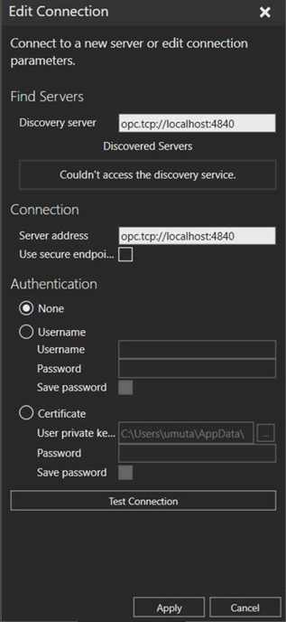

# Quickstart Guide

This document summarizes the essential steps from **Project_Documentation.pdf** for setting up and running your multi-robot simulation.

---

## 1. Prepare/Modify JSON Configuration Files

Before launching the system, ensure you have proper JSON configuration files describing:
- **Robot positions** (in `InitialPositions` property inside the `.vcmx` file)  
- **Pathway Areas** (e.g., `PathwayInfo.json`)  
- **Idle Locations** (e.g., `IdleInfo.json`)  
- **Input/Output Conveyors** (e.g., `Input_Conveyor_Info.json`, `Output_Conveyor_Info.json`)

Each JSON entry typically includes `X`, `Y`, and `Rz` (rotation) attributes plus lengths, widths, or any custom parameters needed. Make sure these files match the 3D layout inside Visual Components so that robots and conveyors spawn correctly.

> **Note:** The default JSON files are referenced in Java code (`CustomNamespace.java`) to initialize pathways, conveyors, and idle locations. Update these paths/names if you place them in a different location.

---

## 2. Set Up the Java OPC-UA Server

1. **Check Dependencies**  
   - Eclipse Milo for OPC-UA.  
   - JADE (Java Agent DEvelopment) for multi-agent logic.  
   - If using Maven, verify your `pom.xml` references JADE properly. Otherwise, you might need to manually add the `jade.jar` (provided in the `opcua` folder) to your IDE’s build path.

2. **Run Server**  
   - *Server.java* is your main entry point. It starts the OPC-UA server on `opc.tcp://localhost:4840`.  
   - Make sure the server logs indicate a successful start with no port conflicts.

3. **Launch the Container**  
   - `Container.java` initializes the JADE environment and starts a `RobotAgent`. This agent interacts via OPC-UA to coordinate tasks like product pickup/dropoff and robot collision avoidance.

---

## 3. Connect Visual Components to the OPC-UA Server

1. **Open the Simulation**  
   - Double-click the `.vcmx` Visual Components file included in your project.  
   - Enable the “Connectivity” add-on by going to *File → Options → Add-ons*.

2. **Add an OPC-UA Connection**  
   - From the “Connectivity” tab, right-click **OPC-UA** and choose “Add Server.”  
   - Point it to `opc.tcp://localhost:4840` (matching the Java server endpoint).  
   - Once connected, you should see logs in Visual Components confirming a link to the server.
   

3. **Run the Simulation**  
   - Click *Play* inside Visual Components to start simulation.  
   - Monitor logs to ensure variables (e.g., `Robot1.Location`, `Conveyor1.Produced`) are updating.  
   - Avoid setting the simulation speed too high since rapid speed-ups can cause missed variable updates.

---

## 4. Check the Example Warehouse Scenario

- This setup spawns multiple **mobile robots** (default eight) from an original “Mobile Robot Resource” inside the layout.  
- **Input conveyors** produce boxes (i.e., `Component1` clones).  
- **Robots** detect these new products (via OPC-UA flags like `Conveyor1Produced`) and navigate pathways to pick them up.  
- **Output conveyors** serve as dropoff points.  
- **Idle locations** keep robots from crowding areas while awaiting tasks.

> You can set the number of robots via the `RobotQuantity` property in Visual Components or the “Robot Quantity” field in the Java `RobotControlUI`. The system then auto-clones the required number of robots.

---

## 5. Verifying Functionality

1. **Open RobotControlUI**  
   - Once the server is running, the custom Swing GUI (`RobotControlUI.java`) can be launched.  
   - Monitor real-time statuses like battery, location, next location, etc.  
   - Toggle checkboxes to simulate produced items on input conveyors or override “stop” flags on a robot.

2. **Observing Robot Movements**  
   - Robots will move along the configured pathways, pick up products, and deliver them.  
   - Collision avoidance ensures they stop or reroute if a path is already occupied.

3. **Customizing**  
   - Modify JSON files or Visual Components properties (e.g., add more “Pathway Area” clones) to scale or reshape the warehouse scenario.  
   - Re-run to see if the new environment settings are recognized.

---

## 6. Troubleshooting Tips

- **Check Log Messages:** Both the OPC-UA server logs and Visual Components’ “Output” window are critical for diagnosing issues.  
- **OPC-UA Connection Fails:** Ensure no firewalls or background processes block port `4840`.  
- **Robots Not Cloning:** Verify `RobotQuantity` > 0 and the `InitialPositions` string is valid JSON.  
- **Agent Logic Not Executing:** Confirm *Container.java* is started, which spawns the `RobotAgent`.  
- **Fast Simulation Speed**: If collisions or updates revert unpredictably, reduce simulation speed or add more delay in your scripts.

---

## 7. Next Steps

- Refer to the [Technical_Details.md](Technical_Details.md) for an in-depth explanation of the scripts, code architecture, collision detection, and multi-agent design.  
