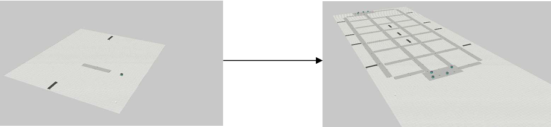

# Technical Details

This document expands on **Project_Documentation.pdf**, explaining how the system’s **Visual Components** scripts, **Java OPC-UA** code, and **Multi-Agent** logic work together.

---

## 1. Visual Components Side

### 1.1 Embedded Python Scripts

All Python control logic for robots, conveyors, pathways, etc. is **embedded** in the `.vcmx` file itself:
- **Robots** (e.g., code in `Mobile Robot Resource`):  
  - Cloning logic for multiple robots based on `RobotQuantity` and `InitialPositions`.  
  - Custom properties: `Location`, `NextLocation`, `BatteryLevel`, `Stop`, `CollisionDetected`, etc.  
  - **Pathfinding** (basic A* or route-based approach) ensures each robot can navigate specified “Pathway Areas.”  
  - **Collision Checks**: Robots regularly check proximity to others; use priority logic or yield if a path is taken.  

- **Pathway Areas**:  
  - Code for dynamically spawning “Pathway Area #2,” “Pathway Area #3,” etc. from a single template.  
  - JSON inputs (like `PathwayInfo.json`) define positions, lengths, widths, rotation angles.  

- **Input Conveyors**:  
  - Clones product components (`Component1`) at fixed intervals.  
  - Toggles “Produced” boolean property, letting the OPC-UA server (and thus JADE agents) know a product awaits pickup.  

- **Output Conveyors**:  
  - Similar logic, but mostly for receiving dropped-off products.  
  - Cloned from a single “Conveyor4” if new output conveyors are specified in `Output_Conveyor_Info.json`.

**Note**: Visual Components spawns or clones new components at runtime, which is how the warehouse scales to many robots and conveyors without manually placing them in the layout.

### 1.2 Key Properties and Flow

Within **Visual Components**:

- **`RobotQuantity`** (integer): How many robots to clone. If set to 8, the original plus 7 clones appear.  
- **`InitialPositions`** (string JSON): The list of `X`, `Y`, `Rz` for each robot’s spawn location.  
- **`Produced`** booleans on conveyors: Triggered whenever new products are created, so robots know to pick them up.  
- **`Collided`, `CollisionDetected`, `Stop`**: Collisions set these flags, which can cause robots to reroute or pause.

---

## 2. OPC-UA + Java Side

### 2.1 Custom Namespace

- **`CustomNamespace.java`** registers your manufacturing data model as OPC-UA variables:
  - For each robot: 
    - `Location`, `NextLocation`, `Stop`, `CarryingProduct`, `BatteryLevel`, etc.
  - For each conveyor: 
    - `Conveyor1Produced`, `Conveyor2Produced`, … controlling product availability signals.
  - Loads JSON configurations (Pathway, Idle, Input/Output conveyors) from local `.json` files to set initial states.

This class also:
  - Periodically simulates battery drain on each robot.  
  - Organizes the OPC-UA address space so external clients can read/write these variables.

### 2.2 Multi-Agent System (JADE)

- **`RobotAgent.java`**:
  - Runs periodic checks (a `TickerBehaviour`) to:  
    1. Identify “produced” conveyors.  
    2. Assign an idle robot to pick up a product if available.  
    3. Manage collisions by checking location overlaps.  
    4. Route robots to random “Output Conveyor” as drop-off targets.
  - Shifts robots back to idle locations after delivery.

- **`RobotTemplate.java`**:
  - Encapsulates each robot’s OPC-UA variable references, including battery, collision flags, etc.
  - A static method `checkForCollisions()` detects potential collisions by comparing `NextLocation` with others.

- **`Container.java`**:
  - Creates a JADE environment, starts the `RobotAgent`.  
  - In a real system, you could add more agents (e.g., “OrderAgent” or “SchedulerAgent”), all sharing the same OPC-UA references.

### 2.3 OPC-UA Server Setup

- **`Server.java`**:  
  - Configures and starts the OPC-UA server on `opc.tcp://localhost:4840`.  
  - Initializes `CustomNamespace` so that all robot and conveyor nodes are declared.  
  - Creates a simple “anonymous allowed” security policy for demonstration (no encryption or user authentication).

---

## 3. User Interface (Swing GUI)

The **`RobotControlUI.java`** program is an OPC-UA client that:
- Monitors each robot’s location, battery level, next location, and whether it’s carrying a product.  
- Lets you manually set a “stop” flag or override a robot’s “target.”  
- Allows toggling of “Produced” checkboxes on conveyors to simulate new products being created.  
- Dynamically reads the `RobotQuantity` OPC-UA variable to re-draw the interface if the number of robots changes at runtime.

This interface offers a convenient way to validate communications between the Java side and Visual Components. When you check “Conveyor 1 Produced,” the robot in the simulation should eventually react to that update.

---

## 4. Notable Implementation Details

1. **Cloning vs. Scripting**  
   - Instead of multiple static `.py` files, each Visual Components “template” (robot, conveyor, etc.) clones additional copies at runtime. This is more parametric and flexible but keep track of your JSON data carefully.

2. **Collision Avoidance**  
   - Basic approach: If two robots share the same `NextLocation`, the lower-priority robot sets `CollisionDetected = true` and `Stop = true`.  
   - Once the path is free, the agent code resets these flags, and the robot continues or recalculates its route.

3. **Task Assignment**  
   - The `RobotAgent` picks an idle robot to fetch newly produced items, using minimal distance heuristics or other custom logic you can expand (like dynamic scheduling or load-balancing).

4. **Battery Drain Simulation**  
   - A scheduled executor in `CustomNamespace.java` reduces the `BatteryLevel` of each robot every 5 seconds. Extended logic could be added to route robots to a “charging station” if battery dips below a threshold.

5. **Performance and Scalability**  
   - The example scenario can handle up to eight robots by default; you can add more by linking new OPC-UA variables or expanding your JSON structures.  
   - Large-scale expansions may need improvements in collision logic or pathfinding for real-time performance.

---

## 5. Extending / Modifying the System

- **Adding More Robots**: Increase `RobotQuantity` in Visual Components or the Java UI. The system will clone more robots, though you must ensure your JSON files have enough positions.  
- **Altering Pathways**: Adjust `PathwayInfo.json` or the relevant property in `CustomNamespace.java` to shape the factory layout. The Python script in the “Pathway Area” component then clones pathways to match.  
- **New Behaviors**: Insert custom Python logic or more Java agents. For example, an agent that checks battery thresholds or calculates more complex collision scenarios is possible.  
- **Advanced Monitoring**: Another external OPC-UA client (like UA Expert) could read these same variables for analytics or integration with other production systems.

---

## 6. References

- **Project_Documentation.pdf**: Provides further detail on quickstart steps, code specifics, JSON file usage, and example scenario.  
- **Visual Components Academy**: [https://academy.visualcomponents.com](https://academy.visualcomponents.com) has tutorials on process modeling and advanced Python scripting in Visual Components.  

Use this `Technical_Details.md` to dive deeper into how the Python scripts, OPC-UA server, and JADE multi-agent system integrate. For immediate setup instructions, see **Quickstart.md**, and for a big-picture introduction, check out the **README.md**