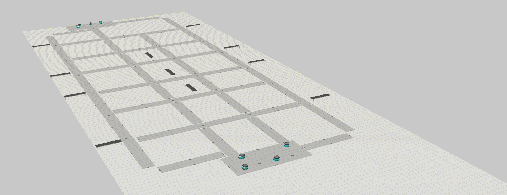
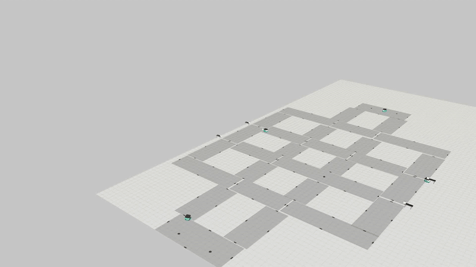
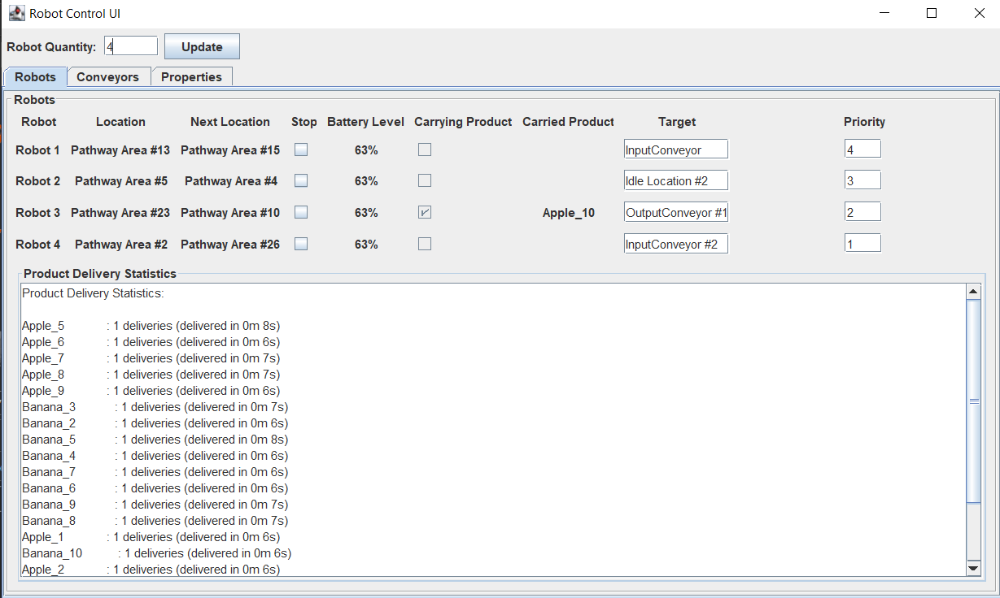
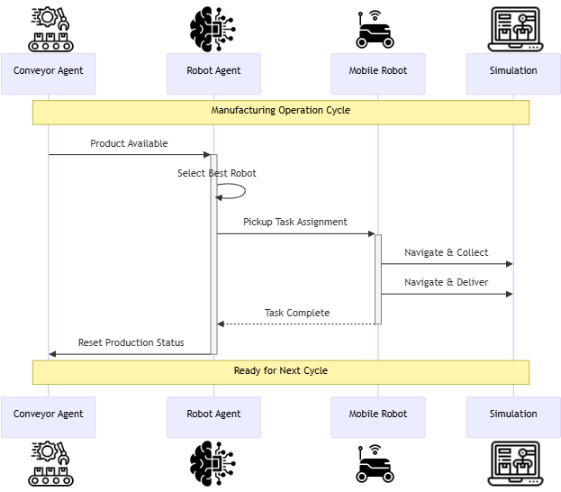

# MultiAgentSystem & VCSimulation Integration


This project consists of two main parts that work together to simulate and control a manufacturing environment:

- **MultiAgentSystem**: The decision-making and coordination "brain" of the system, implemented in Java. It manages agents, logic, and communication.
- **VCSimulation**: The Visual Components simulation environment, using Python scripts to create and control 3D models and their behaviors.

Both systems are connected and synchronized through an OPC UA server, allowing real-time data exchange between the simulation and the agent-based control logic.

To watch a deployment video, please see the videos folder. There you will see how the Multi-agent system with JADE, and Visual Components scripts are deployed.
To get more detail about how each component of the system works, please see docs folder.
<br><br>


<p align="center">
  
  <br><br>
  
  <br><br>
  
</p>

---
## Project Structure

```
├── MultiAgentSystem/                # Java-based agent system (core logic, agents, OPC UA server)
│   ├── src/main/java/.../server/    # Main Java source folder for all agent/server code
│   │   ├── Container.java           # Manages the main simulation container logic
│   │   ├── ConveyorAgent.java       # Agent logic for conveyor operations
│   │   ├── CustomNamespace.java     # Defines OPC UA namespace and data exposure
│   │   ├── RobotAgent.java          # Agent logic for robot operations
│   │   ├── RobotControlUI.java      # Swing UI for robot/conveyor control
│   │   ├── RobotTemplate.java       # Template for robot agent properties/behavior
│   │   ├── Server.java              # Starts and manages the OPC UA server
│   │   └── SystemConfig.java        # Loads and manages system configuration
│   ├── CommunicationServer.xml      # OPC UA server variable mapping/configuration
│   ├── idleProperties.json          # Idle locations for robots
│   ├── inputconveyorProperties.json # Input conveyor definitions and properties
│   ├── outputconveyorProperties.json# Output conveyor definitions and properties
│   ├── pathwayProperties.json       # Pathway/route definitions for robots
│   ├── jade.jar                     # JADE agent platform library
│   ├── json-simple-1.1.1.jar        # JSON parsing library
│   └── pom.xml                      # Maven build configuration
│
├── VCSimulation/                    # Visual Components simulation scripts
│   ├── ConfigurationScript.py        # Sets up simulation components from config
│   └── Simulation_Source_Script.py   # Main simulation logic and OPC UA sync
│
├── docs/                            # Documentation for each major file
│   ├── Container.md
│   ├── ConveyorAgent.md
│   ├── CustomNamespace.md
│   ├── RobotAgent.md
│   ├── RobotControlUI.md
│   ├── RobotTemplate.md
│   ├── Server.md
│   ├── SystemConfig.md
│   ├── Simulation_Source_Script.md
│   └── ConfigurationScript.md
│
└── README.md                        # Project overview and instructions
```

## 1. MultiAgentSystem (Java)

### Purpose
Acts as the central controller for the manufacturing simulation. It manages agents (robots, conveyors), system configuration, and communication with the simulation environment.

### How to Build and Run

**Build:**
1. Make sure you have Java (JDK 8 or higher) and Maven installed.
2. Open a terminal and go to the `MultiAgentSystem` directory.
3. Run:
    ```sh
    mvn clean package
    ```
    This will compile the code and create a JAR file in the `target` folder.

**Run:**
1. In the same terminal, still in the `MultiAgentSystem` directory, run:
    ```sh
    java -jar target/<generated-jar-file>.jar
    ```
    Replace `<generated-jar-file>` with the actual JAR file name (for example, `MultiAgentSystem-1.0-SNAPSHOT.jar`).
2. The system will start the OPC UA server and agent logic. You should see logs or a UI window appear.

**Note:**
- Make sure all required configuration files (the JSON and XML files) are present in the directory.

### Key Components
- **Agents**: Software entities representing robots and conveyors. Each agent can make decisions, interact with others, and update its state.
- **CustomNamespace**: Defines the OPC UA namespace, exposing all relevant data (robot states, conveyor statuses, system properties) to the outside world.
- **SystemConfig**: Central configuration for the number of robots, conveyors, and their properties. It also defines which JSON files are used for layout and properties.
- **OPC UA Server**: Runs inside the Java application, exposing all agent and system data as OPC UA nodes. This allows external systems (like VCSimulation) to read and write data in real time.
- **UI**: A Java Swing-based interface for monitoring and manually controlling robots and conveyors.

### Data Files Used
- **inputconveyorProperties.json**: Contains a list of input conveyors, each with a name, position (X, Y), rotation (Rz), product type, and production interval.
- **outputconveyorProperties.json**: Contains a list of output conveyors, each with a name and position.
- **pathwayProperties.json**: Contains a list of pathway areas, each with a name, position, rotation, length, and width.
- **idleProperties.json**: Contains a list of idle locations for robots, each with a name and position.

### Communication
- **CommunicationServer.xml**: Configuration file for the OPC UA server, specifying endpoints, variable mappings, and data flow directions. It defines how simulation variables (from VCSimulation) are mapped to OPC UA nodes and vice versa.

---

## 2. VCSimulation (Python/Visual Components)

### Purpose
Provides a 3D simulation of the manufacturing environment. It visually represents robots, conveyors, pathways, and products, and simulates their physical behaviors.

### Key Scripts
- **Simulation_Source_Script.py**: The main script containing all logic for creating, cloning, and controlling components in the simulation. It manages robot movement, conveyor operation, product flow, and interaction with OPC UA.
- **ConfigurationScript.py**: Reads configuration, creates all required components in the simulation, and attaches the correct scripts and properties to each one.

### How It Works
- **Component Creation**: Components (robots, conveyors, pathways, idle locations) are created based on configuration data. Each component is assigned properties and scripts for its behavior.
- **Behavior Scripts**: Each type of component (robot, conveyor, etc.) has a dedicated script that defines how it behaves, how it responds to property changes, and how it interacts with other components.
- **OPC UA Integration**: The simulation connects to the OPC UA server (from MultiAgentSystem) using the settings in CommunicationServer.xml. It synchronizes properties (like robot positions, conveyor status, product counts) in both directions.
- **Data Flow**: For example, when a robot moves in the simulation, its position is updated in the OPC UA server, which the MultiAgentSystem can read. Conversely, if the MultiAgentSystem assigns a new target to a robot, this is sent via OPC UA to the simulation, which updates the robot's behavior.

### Data Files Used
- The same JSON files as MultiAgentSystem, for layout and properties.
- **CommunicationServer.xml**: Used to configure the OPC UA connection and variable mappings.

---

## 3. How the Systems Work Together

- **Synchronization**: Both systems use the OPC UA server as a shared data space. The MultiAgentSystem writes agent decisions and reads simulation state; VCSimulation updates the 3D world and reads/writes data as needed.
- **Example Flow**:
    - An input conveyor produces a product (as defined in inputconveyorProperties.json).
    - The simulation updates the OPC UA node for that conveyor's status.
    - The MultiAgentSystem detects the new product, assigns a robot to pick it up, and updates the robot's target via OPC UA.
    - The simulation receives the new target, moves the robot, and updates its position and status in OPC UA.
    - The process repeats for all agents and products.

<br><br>
  
---

## 4. Data and Configuration Files

- **inputconveyorProperties.json**: Defines input conveyors, their positions, product types, and production intervals.
- **outputconveyorProperties.json**: Defines output conveyors and their positions.
- **pathwayProperties.json**: Defines all pathway areas (routes robots can take), with positions, sizes, and orientations.
- **idleProperties.json**: Defines idle locations for robots.
- **CommunicationServer.xml**: Specifies how all simulation variables are mapped to OPC UA nodes, including which properties are read/written and the direction of data flow.

---

## 5. Summary of Roles

- **MultiAgentSystem**: Makes decisions, assigns tasks, manages agent logic, and exposes all data via OPC UA.
- **VCSimulation**: Provides the 3D simulation, executes physical behaviors, and synchronizes all relevant data with the MultiAgentSystem through OPC UA.
- **OPC UA Server**: Acts as the bridge, allowing both systems to read and write shared data in real time.

---

## 6. How to Use

1. Start the MultiAgentSystem (Java application). This launches the OPC UA server and agent logic.
2. Start the Visual Components software. Please make sure you have Connectivity tab open. If it is not automatically enabled you can go to settings, there you will see Add-ons. Please enable Connectivity there. If you do not see any python console on your visual components by default, please follow the guidance here on this link:https://forum.visualcomponents.com/t/addon-store-manage-your-addon-installations/5018 
3. Copy the [ConfigurationScript.py](VCSimulation/ConfigurationScript.py)  file, and paste it into the python console on Visual Components, then execute.
4. You will see all the template components created. Please navigate to the Connectivity tab, on the top left corner click import and import the [CommunicationServer](MultiAgentSystem/CommunicationServer.xml). Then click on the server to connect.
4. The systems will automatically synchronize and begin simulating the manufacturing environment, with agents making decisions and the simulation visualizing the results.

---


