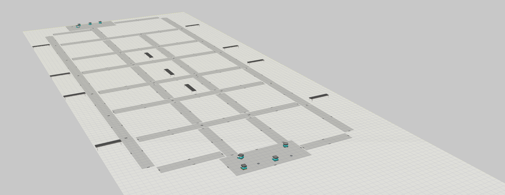
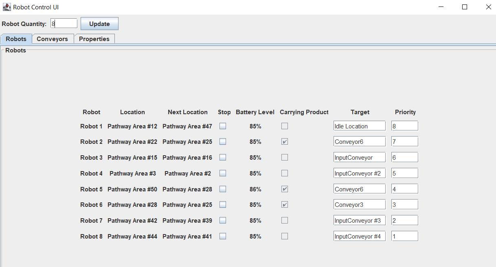

# Multi-Robot OPC-UA Integration with Visual Components

This repository showcases how to decouple control logic from a Visual Components simulation using Java-based OPC-UA connectivity and JADE agents. The end result is a flexible, multi-agent, multi-robot system that coordinates product flows and collision-free navigation in a simulated industrial environment.
<p float="left">
  
  
</p>

## Key Features

### OPC-UA Server & Java Agents
- **JADE (Java Agent DEvelopment)** framework for robot control, task assignment, and collision handling.
- Custom OPC-UA server (using Eclipse Milo) sends/receives simulation data in real time.

### Visual Components Simulation
- Python scripts are embedded in the `.vcmx` layout; no separate `.py` files.
- Robots, conveyors, and pathways clone themselves from templates, referencing JSON configuration (e.g., initial positions, conveyor coordinates).

### Multi-Robot Coordination
- Up to eight mobile robots respond to changing conveyor states, picking and dropping off products while avoiding collisions.
- Collision-handling logic uses OPC-UA flags (e.g., `CollisionDetected`, `UnavailablePathway`) to reroute or stop lower-priority robots.

### Scalable & Modifiable
- Adjust robot count, conveyor positions, or layout properties by editing JSON files and/or the Java code or using the User Interface when you run the system.
- Easily expand or replace output conveyors, add more pathways, or run multiple robot tasks simultaneously.

## Repository Structure

```plaintext
├─ README.md                  ← Top-level overview
├─ Documents/
│   ├─ Quickstart.md          ← Quick setup instructions (from Project_Documentation.pdf)
│   ├─ Project_Documentation.pdf        ← Additional quickstart and technical references
│   ├─ Technical_Details.md   ← In-depth code, scripts, and integration notes
├─ Java Implementation        ← OPC-UA server & multi-agent code under milo.opcua.server/
└─ Simulation.vcmx  ← Contains embedded Python scripts for robots, conveyors, etc.
```

## Visual Components Files

The main simulation file (`.vcmx`) holds all Python scripts inside each component's **Behavior** panel.  
You will not see standalone `.py` files; open the project in Visual Components, select a component (robot, conveyor, etc.), and expand **Modeling → Behaviors** to view or edit its Python script.

## Java Code - OPC-UA & Agents

Placed under packages like `milo.opcua.server`:
- **Server.java** initializes the OPC-UA server on `opc.tcp://localhost:4840`.
- **Container.java** starts JADE, spawning `RobotAgent.java`.
- **RobotTemplate.java** organizes each robot's OPC-UA variables (like battery, location).
- **RobotControlUI.java** opens a Swing-based GUI to watch robot statuses, set priorities, or simulate conveyors producing items.

## JSON Configuration

Files such as `PathwayInfo.json`, `IdleInfo.json`, `Input_Conveyor_Info.json`, and `Output_Conveyor_Info.json` define the layout (positions, rotations, etc.).  
The `CustomNamespace.java` class in the OPC-UA server reads these to set initial states, ensuring the Visual Components simulation can clone the right number of pathways, robots, and conveyors in real time.

## Multi-Agent Control Flow

- Robots remain idle until a conveyor is marked as **Produced**, at which point an agent assigns an available robot to pick up the new item.
- Robots choose pathways or recalculate routes if collisions occur (using example pathfinding logic like A* in the Python script).
- Once a robot drops off its product, it returns to its assigned idle station.

## Getting Started

### Quickstart
For complete setup instructions (installing dependencies, linking Visual Components, running the server, etc.), see [Quickstart Guide](Documents/Quickstart.md) (highlights from [Project Documentation](Documents/Project_Documentation.pdf)).

### Technical Details
Detailed breakdown of how Python scripts clone robots, handle collisions, and link with the Java side is available in [Technical Details](Documents/Technical_Details.md).

## Further Reading

- [Project Documentation](Documents/Project_Documentation.pdf): Quickstart plus deeper instructions.

## Highlights & Tips

- **No `.py` Files**: All VC logic is inside `.vcmx` → Behavior → script name.
- **Run Order**: Typically, start `Server.java` → open Visual Components `.vcmx` → connect OPC-UA in Visual Components → run the simulation.
- **GUI**: `RobotControlUI.java` helps you see robot states, set checkboxes for conveyors, or change robot quantity.
- **Extensibility**: Add more robots by editing `RobotQuantity` on the UI or in the code. Adjust JSON if you want more idle spots or custom pathways.
- **Collision**: Priority-based collision logic ensures a higher-priority robot continues if two collide on the next location.

## Contact

This is an academic demonstration of decentralized control in a manufacturing simulation.  
For questions, collaborations, or bug reports, please see the contact info in [Project Documentation](Documents/Project_Documentation.pdf), or open an Issue/PR on this repository.

For immediate startup steps, see [Quickstart Guide](Documents/Quickstart.md). Finally, consult [Technical Details](Documents/Technical_Details.md) for code-level details.